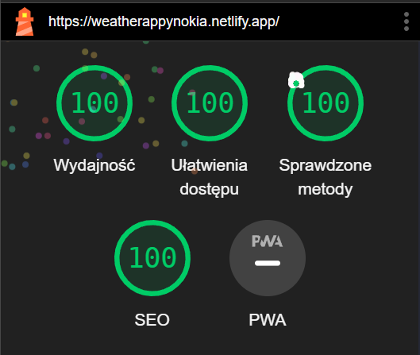

# NokiaWeatherApp

This project was created with passion as an assignment for Nokia Internship.
It was my second attempt at creating smaller angular projects (usually I work with React).
The project is a simple weather app that uses the OpenWeatherMap API to fetch weather data for a given city.
Yet, it taught me a lot about Angular and its features. I am happy with the result and I hope you will like it too.

## Hosting
I have hosted the project on Netlify. You can access it [here](https://poetic-clafoutis-0745de.netlify.app).

Lighthouse score:

## Development server

Run `ng serve` for a dev server. Navigate to `http://localhost:4200/`. The application will automatically reload if you change any of the source files.

## Code scaffolding

Run `ng generate component component-name` to generate a new component. You can also use `ng generate directive|pipe|service|class|guard|interface|enum|module`.

## Build

Run `ng build` to build the project. The build artifacts will be stored in the `dist/` directory.

## Running unit tests

Run `ng test` to execute the unit tests via [Karma](https://karma-runner.github.io).

## Running end-to-end tests

Run `ng e2e` to execute the end-to-end tests via a platform of your choice. To use this command, you need to first add a package that implements end-to-end testing capabilities.

